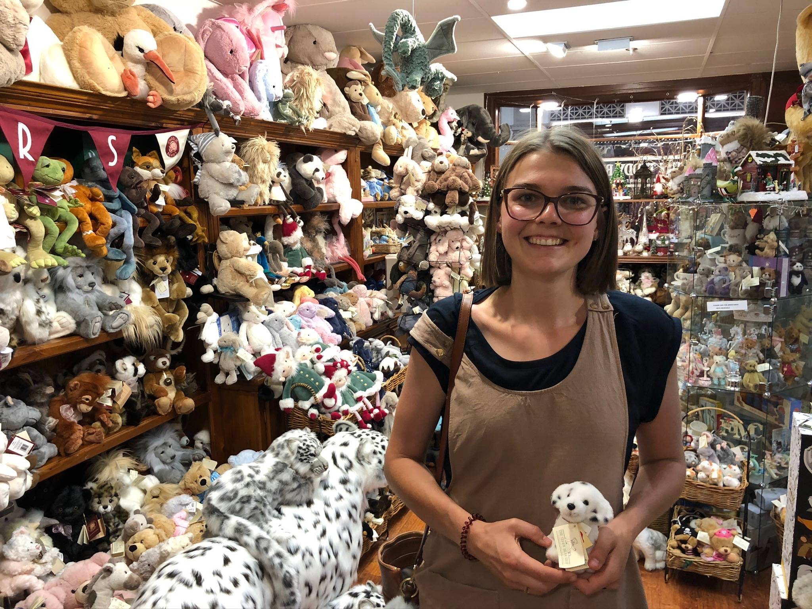

4328 km later, seeing countless number of kangaroos, hours of sitting in the car, numerous slow caravan drivers, 7 apostles, 4 motels, 2 koalas, a giant galah, a dingo, an emu, a giant lobster and a camel we have made it to little old Launceston. So lets fill you in on how the rest of the road trip went:

- - -

After the stress from the past month, packing, selling, cleaning, open homes and quitting jobs it was nice to take some time to relax and explore Esperance. On some recommendations we checked out Twilight beach and Lucky bay. The beaches of Esperance are very highly rated and from the little time we spent there it was easy to see why. Beautiful squeaky, fine, white sand, kangaroos on the beach and crystal clear water. Just a pity we didn’t have a 4WD to be able to explore more and be able to drive on the beach.

*Lucky Bay*

- - -

We charged our batteries in Norseman and powered on over the Nullarbor, driving 13 hours from Norseman to Ceduna. Looking back I’m extremely glad we drove West to East. We were both excited to see what this Nullarbor was all about so the time passed very quickly. We did all the touristy musts; Photos at the boarders (even Lilly managed to get in a few snaps 🐰, stopped at a couple of road houses and all the lookouts along the Great Australian Bight arriving in Ceduna just in time to watch the carols on TV 🎄🎅🎶

*Well worth getting out in the rain for some classic tourist pics*

- - -

Christmas Day. Following our 13 hour long drive the day before, our scheduled 8 hour drive to Adelaide today sounded like a breeze. But boy were we wrong! The hours dragged and after what seemed a decade, split by a visit to streaky bay and a quick snap with the giant galah, we arrived safely in Adelaide. And after a day of peanut butter sandwiches and servo pies we were extremely thankful to find that there were restaurants open, so regenerated our Christmas spirit over a nice Christmas dinner.

*Christmas Snap in Streaky Bay*

*The Giant Galah marking the halfway point*

- - -

Our day in Adelaide came just in time. We spent Boxing Day exploring the city, doing some sales shopping and just enjoying being able to stretch our legs.

*Claire Bear in her element 🐻*

- - -

We hopped back in the car with the hope that driving would now be better as we were heading along the coast. Thankfully it was. We passed through Hahndorf, stopped at cheese world, and a quick google made it clear that there were some unmissable sights along the way in Mount Gambier, which we made sure to visit.

First stop in Mt Gambier: the Blue Lake.\
We turned up with low expectations after seeing the Pink Lake in Esperance but were pleased to be met by the vibrant blue waters of the historic volcano.

Second sight: the Umpherston Sinkhole.\
A sinkhole? Yes, someone in our car was also not very impressed to be going to visit a sinkhole. But, upon arrival it was clear it was no ordinary Baldivis car park sinkhole. It’s a huge sinkhole which has been turned into spectacular gardens, with walkways and caves inside. Well worth a visit if you are ever in the area!

- - -

We started the next day with a stop off at Port fairy. We walked around the town enjoying the cute little cafes and a market that was on. This was one of my favourite places along the way. It’s a super cute little town with beautiful beaches and would be a fantastic camping spot.

We continued onto the Great Ocean Road, and talk about busy! Clearly it was peak tourist season. We battled the crowds and heat to get a few snaps of the remaining 7 Apostles, The Grotto, London Arch, Loch Ard Gorge, Bay Of Martyrs and the Bay Of Islands. We even managed to spot some koalas in the Otway national park. Our last day was spent exploring Melbourne before sailing the Bass Straight south, safely arriving in Tasmania.

*Bay of islands*

*The Grotto*

*Loch Ard Gorge*

*Loch Ard Gorge*

*London Arch*

*The Twelve Apostles*

- - -

*Hope you all have a fantastic start to 2020!*
